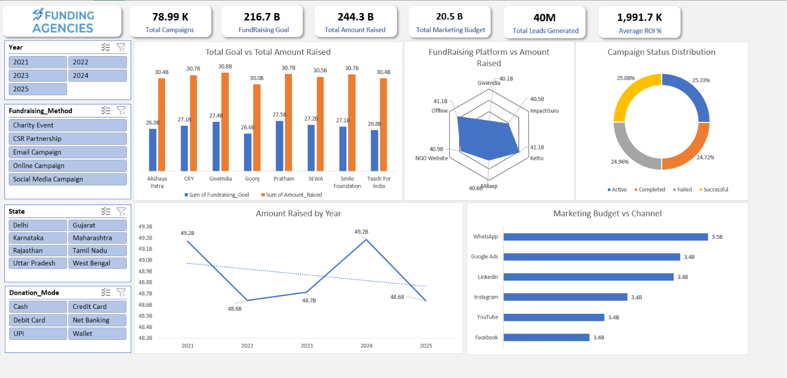

# Funding Agencies Dashboard Report – Excel

> An interactive Excel dashboard for analyzing fundraising performance, campaign outcomes, donor behavior, fundraising platforms, and marketing efficiency.


## 📊 Project Overview

The **Funding Agencies Dashboard** is an Excel-based business intelligence and reporting project designed to convert campaign-level fundraising data into an interactive management dashboard.

The project follows a complete reporting workflow:

**Raw Data → Power Query Transformation → Pivot Table Analysis → Pivot Charts → KPIs & Slicers → Interactive Dashboard**

The dashboard helps users analyze fundraising goals, actual amount raised, campaign status, fundraising platforms, yearly performance, and marketing budget allocation from a single view.

## 🖥️ Dashboard Preview



## 🎯 Objectives

- Monitor overall fundraising performance.
- Compare fundraising goals with actual amounts raised.
- Track fundraising performance across years.
- Compare fundraising platforms by amount raised.
- Understand the distribution of campaign statuses.
- Analyze marketing budget allocation by channel.
- Provide interactive filtering for focused analysis.
- Present complex campaign data in a management-friendly format.

## 📌 Dashboard KPIs

The dashboard displays the following high-level KPIs in the provided dashboard view:

| KPI | Value |
|---|---:|
| Total Campaigns | 78.99 K |
| Fundraising Goal | 216.7 B |
| Total Amount Raised | 244.3 B |
| Total Marketing Budget | 20.5 B |
| Total Leads Generated | 40 M |
| Average ROI | 1,991.7 K |

**Note:** KPI values are from the displayed dashboard view and can change when slicers/filters are applied.

## 📈 Dashboard Visualizations

### 1. Total Goal vs Total Amount Raised

A clustered column chart compares **Fundraising Goal** and **Amount Raised** across organizations/campaigns.

This view helps identify:
- Organizations with stronger fundraising performance.
- Differences between target and actual collections.
- Campaigns with comparatively higher or lower fundraising outcomes.

### 2. Fundraising Platform vs Amount Raised

A radar chart compares fundraising performance across platforms such as:

- GiveIndia
- ImpactGuru
- Ketto
- Milaap
- NGO Website
- Offline

This provides a quick comparison of the relative contribution of different fundraising platforms.

### 3. Campaign Status Distribution

A doughnut chart shows the distribution of campaigns by status:

- Active
- Completed
- Failed
- Successful

This helps assess the overall campaign outcome mix.

### 4. Amount Raised by Year

A line chart tracks fundraising performance from **2021 to 2025**.

It helps identify year-over-year movements and provides a high-level view of fundraising trends over time.

### 5. Marketing Budget vs Channel

A horizontal bar chart compares marketing budget allocation across:

- WhatsApp
- Google Ads
- LinkedIn
- Instagram
- YouTube
- Facebook

This makes it easier to compare where marketing resources are being allocated.

## 🎛️ Interactive Filters

The dashboard uses Excel slicers for interactive analysis.

### Year
- 2021
- 2022
- 2023
- 2024
- 2025

### Fundraising Method
- Charity Event
- CSR Partnership
- Email Campaign
- Online Campaign
- Social Media Campaign

### State
- Delhi
- Gujarat
- Karnataka
- Maharashtra
- Rajasthan
- Tamil Nadu
- Uttar Pradesh
- West Bengal

### Donation Mode
- Cash
- Credit Card
- Debit Card
- Net Banking
- UPI
- Wallet

These slicers allow users to filter the dashboard dynamically and examine selected segments without changing the underlying analysis manually.

## 🔄 Data Preparation with Power Query

**Power Query** was used to transform the source data into an analysis-ready dataset before building the dashboard.

The transformation stage was used to:

- Clean and standardize the dataset.
- Prepare columns for analysis.
- Set appropriate data types.
- Structure date and year fields.
- Prepare numerical measures for aggregation.
- Create a consistent data source for Pivot Table reporting.

## 📊 Analysis with Pivot Tables

After transformation, **Pivot Tables** were used to summarize the data across important business dimensions.

The analysis includes:

- Fundraising goal vs amount raised.
- Organization/campaign performance.
- Fundraising platform performance.
- Campaign status.
- Year-wise amount raised.
- Marketing channel and budget.
- Fundraising method.
- Donation mode.
- State-level analysis.

The Pivot Table outputs were then connected to Pivot Charts and dashboard components.

## 🧩 Dataset

The source data is available in:

`data/FundingAgencies.csv`

The Excel dashboard workbook is available in:

`dashboards/FundingAgencies_Dashboard.xlsx`

### Dataset Columns

| Column | Description |
|---|---|
| `Campaign_ID` | Unique identifier for each campaign |
| `Campaign_Name` | Name of the campaign |
| `Organization` | Organization conducting the campaign |
| `Cause_Category` | Category/cause supported by the campaign |
| `State` | State associated with the campaign |
| `City` | City associated with the campaign |
| `Campaign_Start_Date` | Campaign start date |
| `Campaign_End_Date` | Campaign end date |
| `Campaign_Duration_Days` | Duration of the campaign in days |
| `Fundraising_Goal` | Target fundraising amount |
| `Amount_Raised` | Actual amount raised |
| `Goal_Achievement_%` | Percentage of the goal achieved |
| `Number_of_Donors` | Number of donors |
| `Average_Donation` | Average donation amount |
| `Donor_Type` | Donor category/type |
| `Donation_Mode` | Payment/donation mode |
| `Fundraising_Method` | Method used to raise funds |
| `Fundraising_Platform` | Platform used for fundraising |
| `Marketing_Channel` | Marketing/promotional channel |
| `Marketing_Budget` | Budget allocated to marketing |
| `Impressions` | Number of impressions |
| `Clicks` | Number of clicks |
| `Leads_Generated` | Leads generated from marketing |
| `Conversion_Rate_%` | Conversion rate |
| `ROI_%` | Return on investment |
| `Campaign_Status` | Current/resulting campaign status |
| `Year` | Campaign year |

## 🛠️ Tools & Technologies

- **Microsoft Excel**
- **Power Query**
- **Pivot Tables**
- **Pivot Charts**
- **Excel Slicers**
- **KPI Cards**
- **Data Cleaning & Transformation**
- **Data Visualization**
- **Business Reporting**

## 📐 Project Workflow

```text
              Raw Funding Data
                     │
                     ▼
            Power Query Transform
                     │
          Data Cleaning & Preparation
                     │
                     ▼
              Analysis Dataset
                     │
                     ▼
               Pivot Tables
                     │
              ┌──────┴──────┐
              ▼             ▼
        Pivot Charts      KPIs
              │             │
              └──────┬──────┘
                     ▼
             Excel Slicers
                     │
                     ▼
        Interactive Dashboard
```

## 💡 Business Insights Supported

The dashboard is designed to support questions such as:

- Which organizations are raising the most funds?
- How does the amount raised compare with fundraising goals?
- Which fundraising platforms contribute the highest amounts?
- How does fundraising performance change year over year?
- What proportion of campaigns are active, completed, failed, or successful?
- Which marketing channels receive the highest budgets?
- How do campaign results change by state, year, fundraising method, or donation mode?
- Which segments should receive further investigation based on fundraising and marketing performance?

## 📂 Repository Structure

```text
Funding_Agencies_Dashboard_Report_Excel/
│
├── .github/
│
├── dashboards/
│   └── FundingAgencies_Dashboard.xlsx
│
├── data/
│   └── FundingAgencies.csv
│
├── LICENSE
└── README.md
```

## ▶️ How to Use

1. Clone or download the repository.
2. Open `dashboards/FundingAgencies_Dashboard.xlsx` in Microsoft Excel.
3. Open the dashboard sheet.
4. Use the slicers to filter by year, fundraising method, state, or donation mode.
5. Review the KPI cards and charts for the selected segment.
6. When the source data is updated, refresh the Power Query/Pivot-based report in Excel.

## ⭐ Project Highlights

- Built an interactive funding and campaign performance dashboard in Excel.
- Used **Power Query** for data transformation and preparation.
- Used **Pivot Tables** to summarize campaign and marketing metrics.
- Created KPI cards for management-level reporting.
- Developed multiple business-focused visualizations.
- Added slicers for interactive, multi-dimensional analysis.
- Combined fundraising, donor, platform, and marketing metrics in a single dashboard.

## 👤 Author

**Devesh Dubey**

GitHub: [@deveshdubey18](https://github.com/deveshdubey18)

---

⭐ If this project helped you, consider giving the repository a star.
